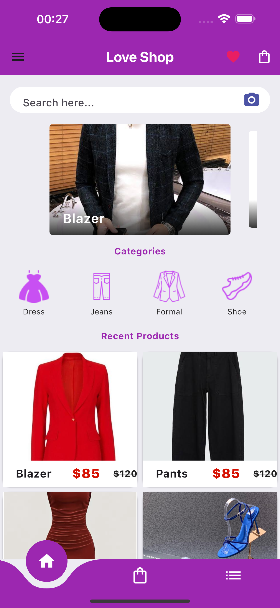
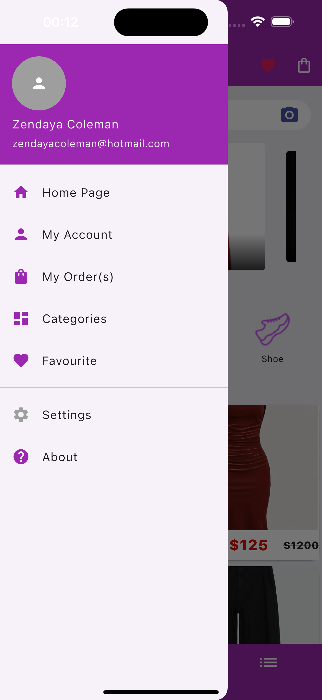
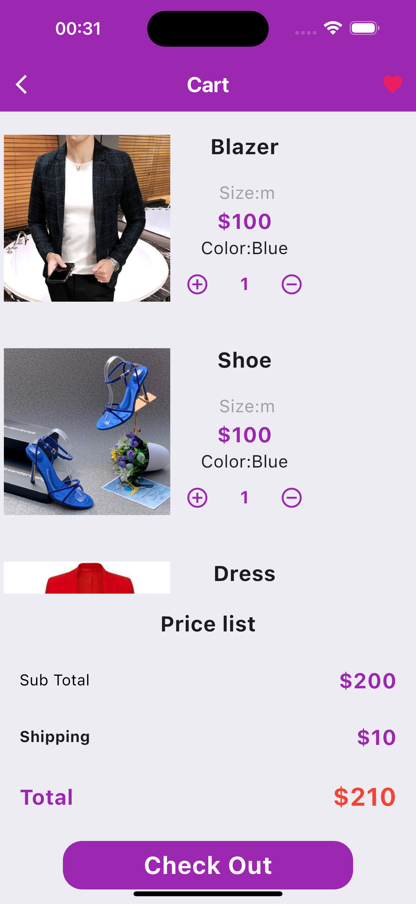
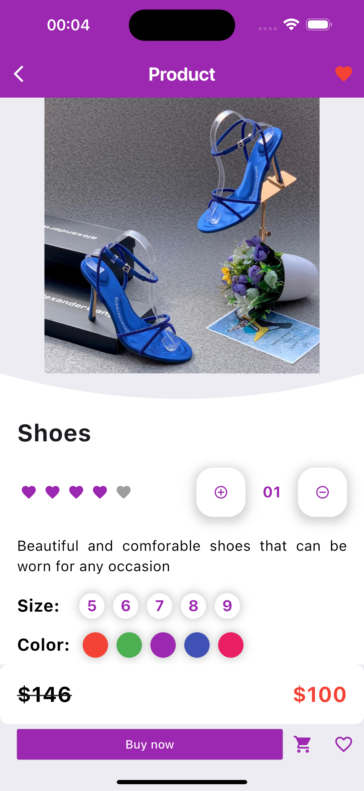

# E-Commerce App 
This project is my first Flutter application, created to learn and practice Flutter widgets. The app showcases a basic e-commerce product page frontend, designed with an intuitive and visually appealing user interface.
### Features
* #### Product Display:
  Highlights products with images, names, descriptions, and pricing (original and discounted).
* #### Interactive Elements:
    * Add or reduce product quantity.
    * Select product sizes and colors.
    * Heart icon for adding products to a wishlist.
* #### Modern UI Components:
    * Bottom navigation bar.
    * Buttons for actions like purchasing.
* #### Responsive Design:
  Optimized for mobile screens.
#### Technologies Used
* Flutter: For creating the frontend using Flutter widgets.
* Dart: As the programming language.
  
## Screenshots
### Home Page

### Profile Page

### Cart Page

### Product Page

### Setup Instructions
1. Clone the repository.
2. Install Flutter SDK and ensure it is properly set up.
3. Run flutter pub get to install dependencies.
4. Use flutter run to launch the app on a simulator or connected device.
### Acknowledgments
This project was created as a part of my Flutter learning journey. It focuses only on the frontend and does not include backend functionality.
Feel free to contribute or provide feedback! 😊

## Demo
#### Simulator Screen Recording 

Simulator Screen Recording - iPhone 15 Pro Max
